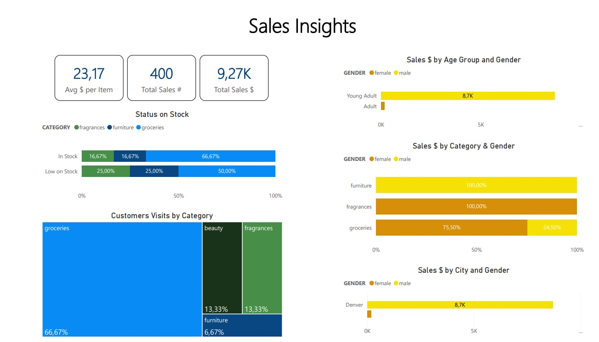

# 📦 DummyJSON Azure–Snowflake Pipeline

> **Automated ELT from REST API → Azure Blob → Snowflake**, with secure secrets, CI/CD, dbt modeling, and Power BI insights.

---

## 📚 Table of Contents

1. [About This Project](#about-this-project)  
2. [Prerequisites](#prerequisites)  
3. [Local Setup](#local-setup)  
4. [Running Locally](#running-locally)  
5. [Deploying to Azure](#deploying-to-azure)  
6. [CI/CD with GitHub Actions](#cicd-with-github-actions)  
7. [Monitoring & Alerts](#monitoring--alerts)  
8. [Project Structure](#project-structure)  
9. [Environment Variables & Secrets](#environment-variables--secrets)  
10. [Snowflake Ingestion Task](#snowflake-ingestion-task)  
11. [Snowflake Storage Integration](#snowflake-storage-integration)  
12. [dbt Models Overview](#dbt-models-overview)  
13. [Power BI Insights](#power-bi-insights)  
14. [Contact](#contact)  
15. [License](#license)  

---

## 📌 About This Project

This end-to-end pipeline:

- **Fetches** JSON from three endpoints:
  - `https://dummyjson.com/products`
  - `https://dummyjson.com/carts`
  - `https://dummyjson.com/users`
- **Stores** each response as a timestamped `.json` file in an Azure Blob container
- **Automates** ingestion using Azure Functions (HTTP & Timer triggers)
- **Secures** secrets via Azure Key Vault
- **Schedules** a Snowflake Task (via CRON) for incremental JSON loads
- **Transforms** data with dbt into a star schema (fact & dimension tables)
- **Visualizes** KPIs in Power BI Desktop
- **Implements** CI/CD with GitHub Actions
- Includes a scheduled dbt Cloud job that runs transformations every 12 hours on Mondays using dbt Cloud IDE

---

## ⚙️ Prerequisites

- **Python 3.10+**  
- **Azure CLI** & **Azure Functions Core Tools (v4)**  
- **Azurite** for local blob emulation:
  ```bash
  npm install -g azurite
  azurite
  ```
- **Git** & **GitHub** repository  
- (Optional) **VS Code** with Azure Functions extension  

---

## 🛠️ Local Setup

1. **Clone the repository**
   ```bash
   git clone https://github.com/norawestadhub/dummyjson-azure-dbt-pipeline.git
   cd dummyjson-azure-snowflake-pipeline
   ```

2. **Create & activate a virtual environment**
   ```bash
   python -m venv .venv
   # Windows
   .\.venv\Scripts\Activate.ps1
   # macOS/Linux
   source .venv/bin/activate
   ```

3. **Install dependencies**
   ```bash
   pip install -r requirements.txt
   ```

4. **Start Azurite (local blob)**
   ```bash
   azurite
   ```

5. **Configure local settings** (`local.settings.json`)
   ```json
   {
     "IsEncrypted": false,
     "Values": {
       "FUNCTIONS_WORKER_RUNTIME": "python",
       "AzureWebJobsStorage": "UseDevelopmentStorage=true",
       "DUMMY_JSON_STORAGE_CONNECTION_STRING": "UseDevelopmentStorage=true",
       "RAW_CONTAINER_NAME": "raw",
       "LOG_LEVEL": "INFO",
       "KEY_VAULT_URI": "https://dummyjsonkvdemonwe.vault.azure.net/"
     }
   }
   ```

---

## ▶️ Running Locally

```bash
func start --verbose --port 7071
```

- **HTTP trigger**: `http://localhost:7071/api/run-pipeline`
- **Timer trigger**: ensure `"runOnStartup": true` in `timerTrigger/function.json`

---

## ☁️ Deploying to Azure

1. **Login & select subscription**
   ```bash
   az login
   az account set --subscription b56061ae-966a-4c51-b38f-35e78d9cebd4
   ```

2. **Publish Azure Functions**
   ```bash
   func azure functionapp publish dummyjson-to-blob-func
   ```

3. **Configure app settings** in Azure Portal:
   - `DUMMY_JSON_STORAGE_CONNECTION_STRING`
   - `KEY_VAULT_URI`
   - `AzureWebJobsStorage`
   - `FUNCTIONS_EXTENSION_VERSION`
   - `FUNCTIONS_WORKER_RUNTIME`
   - `WEBSITE_ENABLE_SYNC_UPDATE_SITE`
   - `WEBSITE_RUN_FROM_PACKAGE`
---

## 🔄 CI/CD with GitHub Actions

Workflow: `.github/workflows/ci-cd.yml`
```yaml
name: CI/CD – Azure Functions

on:
  push:
    branches: [ main ]
  workflow_dispatch:

jobs:
  build-and-deploy:
    runs-on: ubuntu-latest
    steps:
      - uses: actions/checkout@v3
      - uses: actions/setup-python@v4
        with:
          python-version: '3.11'
      - run: |
          pip install --upgrade pip
          pip install -r requirements.txt
      - uses: azure/login@v1
        with:
          creds: ${{ secrets.AZURE_CREDENTIALS }}
      - run: |
          zip -r deployment.zip . -x ".git/*" -x ".venv/*"
      - run: |
          az functionapp deployment source config-zip \
            --resource-group data-dummyjson-demo-nwe-rg \
            --name dummyjson-to-blob-func \
            --src deployment.zip
```

---

## 📊 Monitoring & Alerts

### Azure Functions
- **Application Insights** for telemetry  
- Alert rules for failed executions  

### Snowflake
- Query `INFORMATION_SCHEMA.TASK_HISTORY`  
- (Optional) Log failures to a custom table (e.g. `MONITORING.TASK_FAILURES`)

---

## 🧱 Project Structure

```
dummyjson-azure-dbt-pipeline-main/
├── .github/
│   └── workflows/
│       └── azure-functions-deploy.yml
│       └── dbt-trigger.yml 
├── analysis/
│   └── .gitkeep
├── docs/
│   └── sales-insights-overview.jpg
├── httpTrigger/
│   └── __init__.py
│   └── function.json
├── models/
│   ├── raw/
│   │   ├── carts/
│   │   │   └── raw_carts.sql
│   │   │   └── raw_cart_items.sql
│   │   │   └── schema.yml
│   │   ├── carts_products/
│   │   │   └── raw_carts_products.sql
│   │   │   └── schema.yml
│   │   ├── products/
│   │   │   └── raw_products.sql
│   │   │   └── schema.yml
│   │   ├── users/
│   │   │   └── raw_users.sql
│   │   │   └── schema.yml
│   │   └── sources.yml
│   ├── stg/
│   │   ├── carts/
│   │   │   └── stg_carts.sql
│   │   │   └── schema.yml
│   │   ├── carts_products/
│   │   │   └── stg_carts_products.sql
│   │   │   └── schema.yml
│   │   ├── products/
│   │   │   └── stg_products.sql
│   │   │   └── schema.yml
│   │   ├── users/
│   │   │   └── stg_users.sql
│   │   │   └── schema.yml
│   ├── int/
│   │   ├── carts/
│   │   │   └── int_carts.sql
│   │   │   └── schema.yml
│   │   ├── carts_products/
│   │   │   └── int_carts_products.sql
│   │   │   └── schema.yml
│   │   ├── products/
│   │   │   └── int_products.sql
│   │   │   └── schema.yml
│   │   ├── users/
│   │   │   └── int_users.sql
│   │   │   └── schema.yml
│   ├── mart/
│   │   ├── carts/
│   │   │   └── fact_carts.sql
│   │   │   └── schema.yml
│   │   ├── carts_products/
│   │   │   └── fact_carts_products.sql
│   │   │   └── schema.yml
│   │   ├── products/
│   │   │   └── fact_products.sql
│   │   │   └── schema.yml
│   │   ├── users/
│   │   │   └── fact_users.sql
│   │   │   └── schema.yml
├── dbt_project.yml
├── seeds/
│   └── .gitkeep
├── snapshots/
│   └── .gitkeep
├── sql/
│   ├── tasks/
│   │   └── 01_create_task.sql
│   └── AzuriteConfig
├── timeTrigger/
│   └── __init__.py
│   └── function.json
├── .funcignore
├── .gitignore
├── host.json
├── local-settings.json
├── README.md
├── requirements.txt
├── shared.py


```

---

## 🔐 Environment Variables & Secrets

| Variable                               | Description                                    |
| -------------------------------------- | ---------------------------------------------- |
| `AzureWebJobsStorage`                  | Azure Functions storage connection string      |
| `DUMMY_JSON_STORAGE_CONNECTION_STRING` | Blob storage connection string                 |
| `RAW_CONTAINER_NAME`                   | Blob container name (e.g. `raw`)               |
| `LOG_LEVEL`                            | Logging level (`INFO`, `DEBUG`, etc.)          |
| `KEY_VAULT_URI`                        | Azure Key Vault URI (do **not** commit real URI) |
| `AZURE_CREDENTIALS`                    | GitHub Actions service principal credentials   |

> **Note**: Do **not** commit actual secrets or URIs to public repositories. Use placeholders and configure them via CI/CD or deployment settings.

---

## ❄️ Snowflake Ingestion Task

Defined in `sql/tasks/01_create_task.sql`, this:

1. Creates file format & external stage for Azure Blob  
2. Defines raw tables (`raw_products`, `raw_carts`, `raw_users`) with `VARIANT` + `file_name`  
3. Creates a Snowflake Task (CRON) to **incrementally** load only new JSON files  
4. Uses `INSERT ... WHERE file_name NOT IN (...)` to avoid duplicates  

Run manually:
```bash
snowsql -f sql/tasks/01_create_task.sql
```

---

## 🧊 Snowflake Storage Integration

1. **Create integration**:
   ```sql
   CREATE OR REPLACE STORAGE INTEGRATION MY_AZURE_INT
     TYPE = EXTERNAL_STAGE
     STORAGE_PROVIDER = 'AZURE'
     ENABLED = TRUE
     AZURE_TENANT_ID = '<TENANT_ID>'
     STORAGE_ALLOWED_LOCATIONS = ('azure://<account>.blob.core.windows.net/raw');
   ```

2. **Grant** `Storage Blob Data Reader` to Snowflake-managed identity  
3. **Use** the integration in your stage definition  

---

## 📦 dbt Models Overview

- **Raw models** (`raw_*`): load JSON payloads into a VARIANT column + capture `file_name`.  
- **Staging** (`stg_*`): extract upload date from `file_name`, select only the latest file per entity, then flatten JSON arrays.  
- **Intermediate** (`int_*`): compute metrics & enrich data (cart size, average price, age group, discounted price).  
- **Star schema**:  
  - **fact_carts**, **fact_carts_products**  
  - **dim_users**, **dim_products**  
- **Tests**: `not_null`, `unique`, `accepted_values`  

## 🔄 CI/CD with GitHub Actions

Workflow: `.github/workflows/dbt-trigger.yml`
```yaml
name: Trigger dbt Cloud Job

name: CI/CD – Azure Functions

on:
  push:
    branches: [ main ]
  workflow_dispatch:

jobs:
  build-and-deploy:
    runs-on: ubuntu-latest
    steps:
      - uses: actions/checkout@v3
      - uses: actions/setup-python@v4
        with:
          python-version: '3.11'
      - run: |
          pip install --upgrade pip
          pip install -r requirements.txt
      - uses: azure/login@v1
        with:
          creds: ${{ secrets.AZURE_CREDENTIALS }}
      - run: |
          zip -r deployment.zip . -x ".git/*" -x ".venv/*"
      - run: |
          az functionapp deployment source config-zip \
            --resource-group data-dummyjson-demo-nwe-rg \
            --name dummyjson-to-blob-func \
            --src deployment.zip

- dbt models are scheduled via dbt Cloud IDE using a time-based trigger (every 12 hours on Mondays).
- Full CI/CD integration with dbt Cloud via API is not enabled due to billing plan limitations, but the project demonstrates CI/CD capabilities through GitHub Actions for Azure Functions.

```
---

## 📊 Power BI Report

A **Power BI Desktop** report illustrating key insights is available:



### Key Performance Indicators
- **Avg $ per Item**: Average sales amount per item sold  
- **Total Sales #**: Total number of items sold  
- **Total Sales $**: Total sales value in USD  

### Stock Status by Category
- **100%‐stacked bar chart** showing share of products “In Stock” vs. “Low on Stock” broken down by category  

### Customer Visits by Category
- **Tree map** illustrating percentage of customer visits per product category  

### Sales $ by Age Group and Gender
- **100%‐stacked bar chart** of total sales value by age group, split by gender  

### Sales $ by Category & Gender
- **100%‐stacked bar chart** of total sales value by product category, split by gender  

### Sales $ by City and Gender
- **100%‐stacked bar chart** of total sales value by city, split by gender  

> **Note**: All sales figures are derived from the latest snapshot loaded into Snowflake, filtered to the newest file per entity.

---

## 📬 Contact

For issues or questions, please open a GitHub issue or contact the maintainer.

